# UX Audit Skill — How It Works

```mermaid
flowchart TD
    INPUT["📥 User gives input\n──────────────────\nCan be any of these:\n• Live URL (website/app link)\n• Frontend code (React, Vue, etc)\n• Mobile code (React Native, Swift)\n• Screenshots\n• Backend code\n• Any combination"]

    STEP0["🔍 STEP 0 — Understand the Product\n──────────────────────────────────\nBefore auditing anything, agent learns:\n• What does this product do?\n• Who uses it? (age, tech level, device)\n• What are the main things users try to do?\n• What flows matter most? (sign-up, buy, upload…)\n• Do you have any user data? (analytics, complaints)\n• Is there adult content / health data / payments?\n  → If yes, mandatory safety check added"]

    STEP0Q{"Does it need\ncredentials or\ntest accounts?"}

    CREDS["🔐 Ask for login before starting\n——————————————————\nNever discover a login wall mid-audit.\nIf not given → mark those flows\nas 'cannot test — need access'"]

    DETECT["🧭 STEP 1.5 — What type of input is it?\n─────────────────────────────────────────\nAgent decides which workers to launch"]

    LANEA_WEB["🌐 LANE A — Live Website/URL\n─────────────────────────────\nBrowses the real site like a user would"]
    LANEB_WEB["💻 LANE B — Web Frontend Code\n──────────────────────────────\nReads the code directly"]
    LANEB_MOB["📱 LANE B — Mobile App Code\n────────────────────────────\nReads React Native / Flutter / Swift code"]
    LANEC["⚙️ LANE C — Backend Code\n─────────────────────────\nChecks server-side patterns"]

    subgraph LANEA_DETAIL["LANE A — What it checks (Website)"]
        P1["🖥️ PASS 1 — Desktop (1440px)\n───────────────────────────────\nBrowses every page without screenshots.\nJust notes all problems it spots.\n~15-20 tool calls total"]
        P1B["📱 PASS 1B — Mobile (390px)\n──────────────────────────────\nSame primary journey, mobile width.\nLooks for: things that overflow sideways,\nnav that breaks, text too small, buttons\ntoo tiny to tap, forms that go off-screen"]
        SCORE["📊 Score every finding\n────────────────────────\nP0 = Blocker (fix NOW)\nP1 = Serious (fix this sprint)\nP2 = Moderate (backlog)\nP3 = Polish (nice to have)"]
        P2["📸 PASS 2 — Take screenshots\n──────────────────────────────\nOnly for P0 and P1 problems.\nDesktop screenshot + mobile screenshot.\nAnnotates the exact broken element in red.\nP2/P3 = no screenshots (saves time)"]
    end

    subgraph LANEB_WEB_DETAIL["LANE B — What it checks (Web Code)"]
        BW1["HTML structure\nAre forms labelled? Are buttons semantic?\nDoes heading order make sense?"]
        BW2["Component states\nDoes every button have:\ndefault, hover, loading, error, disabled,\nsuccess states?"]
        BW3["Performance patterns\nHero image lazy-loaded? (bad)\nCSS tricks that cause slowness?"]
        BW4["Anti-slop code\ntransition-all? z-index:9999?\nThese are AI-generated template tells"]
        BW5["Lighthouse audit\nLCP / CLS / TBT scores\n(only if local server is running)"]
    end

    subgraph LANEB_MOB_DETAIL["LANE B — What it checks (Mobile Code)"]
        MB1["🗺️ Map all screens & navigation\nReads the router config.\nFinds every screen file.\nMaps: what connects to what?"]
        MB2["🔍 User flow gaps\nMissing back buttons?\nScreens with no error state?\nLists with no empty state?\nAsync calls with no loading spinner?"]
        MB3["👆 Touch & interaction\n44px minimum tap targets?\nHaptics on important actions?\nThumb zone for primary CTAs?"]
        MB4["⌨️ Keyboard & forms\nKeyboard type matches field?\n(email → email keyboard)\nKeyboard hiding inputs?"]
        MB5["⚡ Performance\nFlatList not ScrollView for lists?\nmemo/useCallback on list items?\nNative driver on animations?"]
        MB6["🔧 Platform patterns\nSafeAreaView present?\nPermissions at right time?\nPush notification → right screen?"]
    end

    RENDER["🚀 Can we render the mobile app?\n─────────────────────────────────\n1st: Try Expo Web / Flutter Web\n2nd: Try React Native Web + Vite\n3rd: Try Storybook (component view)\n4th: Ask user for screenshots\n\n→ If web build works: run Lane A on it too!\n→ Always note how visual audit was done"]

    MERGE["🔗 Main agent collects all results\n────────────────────────────────────\n• Removes duplicate findings\n• Forces P0 on anything blocking\n  sign-in / payment / legal consent\n• Groups by category (IA, FORM, PERF…)"]

    SLOP["🤖 STEP 3 — AI-Slop Check\n─────────────────────────────\nLooks for signs the UI was\nAI-generated without craft:\n• Purple gradient + generic grid\n• transition-all everywhere\n• Every card has hover:scale\n• No real personality or voice\n• Fake social proof numbers"]

    ADVISORY["🧠 STEP 3.5 — Make it Better\n──────────────────────────────\nThis is NOT about finding bugs.\nThis is: how could it be much better?\n\n• Could any journey be shorter?\n• Where will users hesitate or leave?\n• What is hidden that should be obvious?\n• What do best-in-class products do\n  that this one doesn't?\n• What does the user FEEL at each step?\n  Map the emotional journey — find the\n  confidence valley before the payoff\n• At each commitment (sign-up, pay,\n  upload) what fear does the user have?\n  What does the UI give them now?\n  What should it give them?\n• Does the UX match the brand promise?\n• What is the 'aha moment' and how\n  many steps before the user reaches it?"]

    PSYCH["⚠️ MANDATORY: At least 1 PSYCH finding\n──────────────────────────────────────\nEvery product has a moment where\nusers feel scared, doubtful, or unsure.\nAgent MUST find and file it.\nExample: signup with no privacy reassurance\n= users wonder 'will I get spam?'"]

    ERROR_TEST["🔴 Error-state testing\n───────────────────────\nAgent MUST test these on every audit:\n→ Type wrong email → good error message?\n→ Hit back mid-form → data saved?\n→ Submit with no internet → clear message?\n→ Wrong password → not locked immediately?\n→ Upload wrong file type → client error?\n→ Search with no results → helpful state?"]

    REPORT["📄 STEP 5 — Write the Report\n──────────────────────────────\nReport has:\n✦ Executive summary (grade A-F)\n✦ What works (positives first)\n✦ All findings with:\n   - What's broken (plain English)\n   - Who it affects and how badly\n   - Steps to reproduce\n   - Before/after code fix\n   - Screenshot evidence\n✦ UX Recommendations (not bugs —\n  specific ideas to make it better)\n✦ Psychological barriers table\n✦ Strategic UX position\n✦ New feature ideas\n✦ Quick wins (< 1 hour each)\n✦ Roadmap: P0 → P1 → P2 → P3"]

    SEND["📤 STEP 6 — Deliver\n─────────────────────\n• Save as .md file in ~/audits/\n• Convert to PDF\n• Send to Discord"]

    %% Main flow
    INPUT --> STEP0
    STEP0 --> STEP0Q
    STEP0Q -->|"Yes"| CREDS
    STEP0Q -->|"No / Public"| DETECT
    CREDS --> DETECT

    DETECT -->|"URL provided"| LANEA_WEB
    DETECT -->|"Web code provided"| LANEB_WEB
    DETECT -->|"Mobile code provided"| LANEB_MOB
    DETECT -->|"Backend code provided"| LANEC

    LANEA_WEB --> LANEA_DETAIL
    P1 --> P1B --> SCORE --> P2

    LANEB_WEB --> LANEB_WEB_DETAIL

    LANEB_MOB --> RENDER
    RENDER -->|"Web build works"| LANEA_WEB
    RENDER --> LANEB_MOB_DETAIL

    LANEA_DETAIL --> MERGE
    LANEB_WEB_DETAIL --> MERGE
    LANEB_MOB_DETAIL --> MERGE
    LANEC --> MERGE

    MERGE --> SLOP
    SLOP --> ADVISORY
    ADVISORY --> PSYCH
    ADVISORY --> ERROR_TEST
    PSYCH --> REPORT
    ERROR_TEST --> REPORT
    REPORT --> SEND

    %% Styling
    style INPUT fill:#4A90D9,color:#fff,stroke:#2C6FAC
    style STEP0 fill:#7B68EE,color:#fff,stroke:#5B48CE
    style DETECT fill:#20B2AA,color:#fff,stroke:#008B8B
    style LANEA_WEB fill:#3CB371,color:#fff,stroke:#2E8B57
    style LANEB_WEB fill:#FF8C00,color:#fff,stroke:#CC7000
    style LANEB_MOB fill:#FF6347,color:#fff,stroke:#CC4F38
    style LANEC fill:#9370DB,color:#fff,stroke:#7B52CC
    style RENDER fill:#FF6347,color:#fff,stroke:#CC4F38
    style MERGE fill:#20B2AA,color:#fff,stroke:#008B8B
    style SLOP fill:#DC143C,color:#fff,stroke:#AA1030
    style ADVISORY fill:#DAA520,color:#fff,stroke:#B8860B
    style PSYCH fill:#FF4500,color:#fff,stroke:#CC3700
    style ERROR_TEST fill:#CC0000,color:#fff,stroke:#990000
    style REPORT fill:#228B22,color:#fff,stroke:#1A6B1A
    style SEND fill:#1E90FF,color:#fff,stroke:#1874CD
    style CREDS fill:#708090,color:#fff,stroke:#556677
    style SCORE fill:#3CB371,color:#fff,stroke:#2E8B57
```

---

## Simple Summary — What Happens Step by Step

| Step | What the agent does | Why |
|------|--------------------|----|
| **1. Understand** | Learns what the product is, who uses it, what flows matter | Can't audit well without context |
| **2. Ask upfront** | Requests login, funnel data, flags sensitive content | Prevents dead-ends mid-audit |
| **3. Detect input** | Identifies: URL / web code / mobile code / backend / screenshots | Each type needs different workers |
| **4a. Browse site** | Desktop (1440px) + mobile (390px) — two full passes | Real users use both — must check both |
| **4b. Read web code** | Checks structure, states, performance, anti-patterns | Code reveals things the browser hides |
| **4c. Read mobile code** | Maps every screen + nav flow, checks touch/keyboard/state | Mobile has unique patterns web doesn't |
| **4d. Render mobile** | Tries Expo Web / Flutter Web to get real screenshots | Screenshots > code-only guesses |
| **5. Score** | P0 blocker → P3 polish — every finding ranked | Tells team what to fix first |
| **6. Anti-slop** | Checks for AI-generated template tells | Flags low-craft design |
| **7. Advisory** | Maps emotional journey, finds conversion barriers | Finds what's not broken but could be great |
| **8. Error testing** | Wrong input, back button, no internet, expired session | Finds failures real users hit |
| **9. Report** | Grade + findings + fixes + roadmap + feature ideas | Everything team needs to act |
| **10. Deliver** | PDF → Discord | Done |
